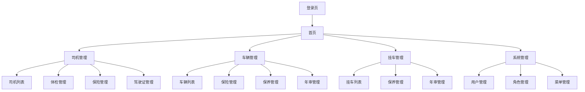

## 1. 产品概述
车队管理系统是一款专为运输企业设计的综合管理平台，用于统一管理车辆、挂车、司机等核心资源。
通过数字化手段解决传统车队管理效率低、信息分散、预警滞后等问题，帮助车队管理者实时掌握运营状况，降低运营风险。

## 2. 核心功能

### 2.1 用户角色
| 角色 | 注册方式 | 核心权限 |
|------|----------|----------|
| 超级管理员 | 初始创建 | 系统所有功能权限，包括用户管理、角色分配 |
| 车队管理员 | 超级管理员创建 | 车辆、挂车、司机管理，查看统计报表 |
| 普通用户 | 管理员创建 | 查看权限范围内的车辆、司机信息 |

### 2.2 功能模块
车队管理系统包含以下核心页面：
1. **登录页**：用户身份验证、记住密码、验证码。
2. **首页**：数据统计概览、到期预警提醒、快捷操作入口。
3. **司机管理**：司机信息列表、体检记录管理、保险记录管理、驾驶证管理。
4. **车辆管理**：车辆信息列表、保险管理、保养管理、年审管理。
5. **挂车管理**：挂车信息列表、保养管理、年审管理。
6. **系统管理**：用户管理、角色权限管理、菜单管理、操作日志。

### 2.3 页面详情
| 页面名称 | 模块名称 | 功能描述 |
|----------|----------|----------|
| 登录页 | 身份验证 | 输入用户名密码登录系统，支持记住密码和验证码功能 |
| 首页 | 数据统计 | 显示总车辆数、总挂车数、总司机数等核心统计数据 |
| 首页 | 到期预警 | 展示司机体检、保险到期，车辆保险、保养、年审等到期预警 |
| 司机管理 | 司机列表 | 查看所有司机基本信息，支持搜索、筛选、导出功能 |
| 司机管理 | 体检管理 | 记录司机体检信息，设置到期提醒，查看历史体检记录 |
| 司机管理 | 保险管理 | 管理司机保险信息，跟踪保险有效期，自动提醒续保 |
| 司机管理 | 驾驶证管理 | 管理驾驶证信息，包括初次领证日期、有效期限、准驾车型等 |
| 车辆管理 | 车辆列表 | 管理牵引车和单体车信息，支持按类型、状态筛选 |
| 车辆管理 | 保险管理 | 记录车辆保险信息，包括交强险、商业险等，设置到期提醒 |
| 车辆管理 | 保养管理 | 记录保养历史，设置保养周期提醒，跟踪下次保养时间 |
| 车辆管理 | 年审管理 | 管理车辆年审记录，提醒年审到期时间 |
| 挂车管理 | 挂车列表 | 管理挂车基本信息，支持按类型、长度筛选 |
| 挂车管理 | 保养管理 | 记录挂车保养信息，设置保养提醒 |
| 挂车管理 | 年审管理 | 管理挂车年审记录，跟踪年审有效期 |
| 系统管理 | 用户管理 | 创建、编辑、删除系统用户，分配角色权限 |
| 系统管理 | 角色管理 | 定义不同角色，分配菜单和数据权限 |
| 系统管理 | 菜单管理 | 管理系统菜单结构，支持动态配置菜单权限 |

## 3. 核心流程

### 管理员操作流程
1. 管理员通过登录页进入系统
2. 在首页查看车队整体运营数据统计和到期预警
3. 进入司机管理模块，维护司机基本信息和相关证件记录
4. 在车辆管理模块录入车辆信息，跟踪保险、保养、年审状态
5. 在挂车管理模块管理挂车信息和维护记录
6. 通过系统管理模块配置用户权限和菜单结构

### 普通用户操作流程
1. 用户登录系统
2. 查看权限范围内的数据统计
3. 浏览被授权的车辆、司机、挂车信息
4. 无法进行修改和删除操作

## 4. 用户界面设计

### 4.1 设计风格
- **主色调**：明亮柔和色系，天蓝色（#87CEEB）、草绿色（#90EE90）、暖黄色（#FFE4B5）为主，搭配白色背景营造轻松氛围
- **按钮样式**：大圆角设计（圆角半径12-16px），主要操作为渐变色填充按钮，次要操作为浅色线框按钮，悬停时有弹性动画效果
- **字体**：圆润友好字体，主要文字14px，标题16-20px，重要数字使用加粗展示
- **布局风格**：左侧菜单+顶部导航布局，所有卡片采用大圆角（圆角半径16-24px），增加柔和阴影效果
- **图标风格**：使用彩色卡通风格图标，线条圆润，配合emoji表情符号增加趣味性

### 4.2 页面设计概览
| 页面名称 | 模块名称 | UI元素 |
|----------|----------|--------|
| 首页 | 数据统计卡片 | 采用大圆角卡片布局，每个统计项用彩色卡通图标+大数字展示，背景使用渐变色，支持点击查看详情 |
| 首页 | 预警提醒 | 使用橙色或黄色温和提醒标识，按到期时间排序，配合emoji表情减少紧张感，支持一键标记已处理 |
| 列表页 | 数据表格 | 采用圆角表格设计，表头使用渐变色，行与行之间有柔和分隔线，支持排序、筛选、分页、导出功能 |
| 表单页 | 信息录入 | 采用分步表单或标签页形式，输入框使用大圆角设计，必填项用橙色星号标识，配合友好的提示文案 |
| 详情页 | 信息展示 | 采用大圆角卡片形式，关键信息使用彩色标签突出显示，整体配色温和舒适 |

### 4.3 响应式设计
- **设计原则**：桌面端优先，适配主流浏览器
- **断点设置**：支持1920px、1366px、1024px等常见分辨率
- **移动端**：提供基础的移动端适配，主要功能可在平板设备上使用