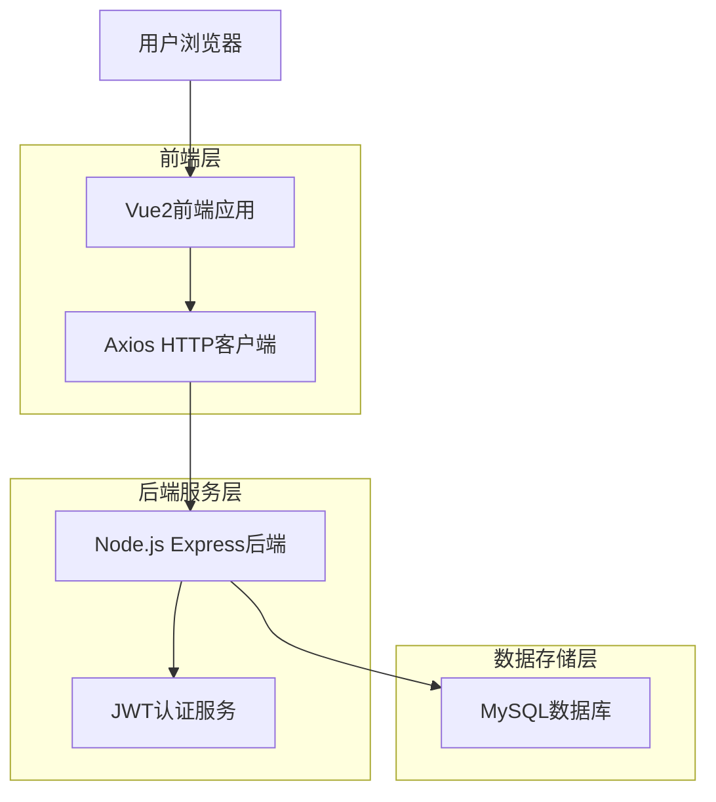
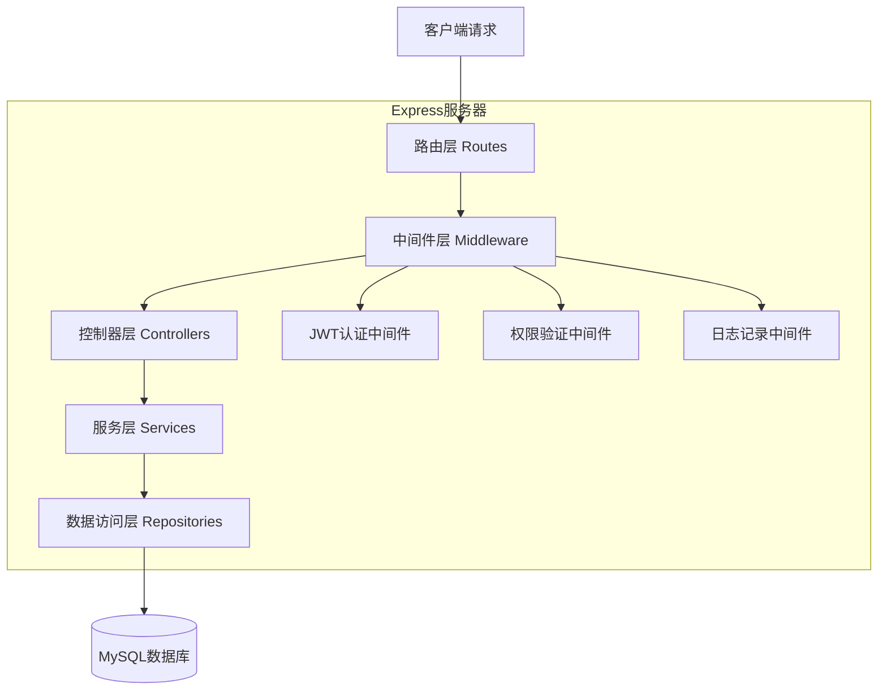
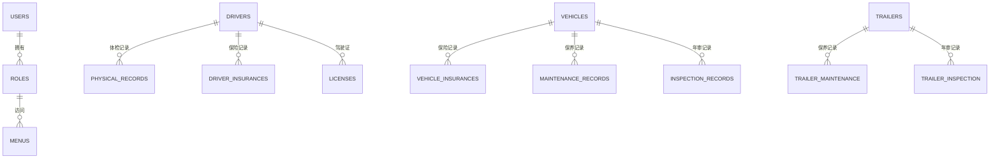

## 1. 架构设计



## 2. 技术栈描述

- **前端框架**：Vue2@2.6 + Vue Router@3 + Vuex@3
- **UI组件库**：Element UI@2.15
- **HTTP客户端**：Axios@0.21
- **构建工具**：Vue CLI@4
- **后端框架**：Node.js@14 + Express@4.17
- **数据库**：MySQL@8.0
- **ORM框架**：Sequelize@6
- **认证方案**：JWT@8.5
- **密码加密**：bcrypt@5.0

## 3. 路由定义

| 路由路径 | 页面名称 | 功能描述 |
|----------|----------|----------|
| /login | 登录页 | 用户身份验证 |
| / | 首页 | 数据统计概览 |
| /drivers | 司机管理 | 司机信息列表 |
| /drivers/physical | 体检管理 | 司机体检记录 |
| /drivers/insurance | 保险管理 | 司机保险记录 |
| /drivers/license | 驾驶证管理 | 驾驶证信息管理 |
| /vehicles | 车辆管理 | 车辆信息列表 |
| /vehicles/insurance | 车辆保险 | 车辆保险管理 |
| /vehicles/maintenance | 车辆保养 | 车辆保养记录 |
| /vehicles/inspection | 车辆年审 | 车辆年审管理 |
| /trailers | 挂车管理 | 挂车信息列表 |
| /trailers/maintenance | 挂车保养 | 挂车保养记录 |
| /trailers/inspection | 挂车年审 | 挂车年审管理 |
| /system/users | 用户管理 | 系统用户管理 |
| /system/roles | 角色管理 | 角色权限管理 |
| /system/menus | 菜单管理 | 系统菜单配置 |

## 4. API接口定义

### 4.1 认证相关API

**用户登录**
```
POST /api/auth/login
```

请求参数：
| 参数名 | 类型 | 必填 | 描述 |
|--------|------|------|------|
| username | string | 是 | 用户名 |
| password | string | 是 | 密码 |

响应示例：
```json
{
  "code": 200,
  "message": "登录成功",
  "data": {
    "token": "eyJhbGciOiJIUzI1NiIsInR5cCI6IkpXVCJ9...",
    "userInfo": {
      "id": 1,
      "username": "admin",
      "role": "admin"
    }
  }
}
```

**获取用户信息**
```
GET /api/auth/userinfo
```

请求头：
```
Authorization: Bearer {token}
```

### 4.2 司机管理API

**获取司机列表**
```
GET /api/drivers?page=1&limit=10&keyword=张三
```

响应示例：
```json
{
  "code": 200,
  "data": {
    "list": [
      {
        "id": 1,
        "name": "张三",
        "phone": "13800138000",
        "idCard": "110101199001011234",
        "driverLicense": "A1A2",
        "status": "active",
        "createTime": "2024-01-01 10:00:00"
      }
    ],
    "total": 100,
    "page": 1,
    "limit": 10
  }
}
```

**添加司机**
```
POST /api/drivers
```

请求体：
```json
{
  "name": "张三",
  "phone": "13800138000",
  "idCard": "110101199001011234",
  "driverLicense": "A1A2",
  "licenseIssueDate": "2020-01-01",
  "licenseExpiryDate": "2030-01-01"
}
```

### 4.3 车辆管理API

**获取车辆列表**
```
GET /api/vehicles?page=1&limit=10&type=tractor
```

**添加车辆**
```
POST /api/vehicles
```

请求体：
```json
{
  "plateNumber": "京A12345",
  "type": "tractor",
  "brand": "解放",
  "model": "J6P",
  "purchaseDate": "2020-01-01",
  "status": "active"
}
```

### 4.4 统计API

**获取首页统计数据**
```
GET /api/dashboard/statistics
```

响应示例：
```json
{
  "code": 200,
  "data": {
    "totalVehicles": 50,
    "totalTrailers": 30,
    "totalDrivers": 25,
    "expiringPhysical": 3,
    "expiringDriverInsurance": 2,
    "expiringVehicleInsurance": 5,
    "expiringMaintenance": 8,
    "expiringInspection": 4
  }
}
```

## 5. 服务器架构设计



## 6. 数据模型设计

### 6.1 实体关系图



### 6.2 数据库表结构

**用户表 (users)**
```sql
CREATE TABLE users (
    id INT PRIMARY KEY AUTO_INCREMENT,
    username VARCHAR(50) UNIQUE NOT NULL COMMENT '用户名',
    password_hash VARCHAR(255) NOT NULL COMMENT '密码哈希',
    email VARCHAR(100) UNIQUE COMMENT '邮箱',
    phone VARCHAR(20) COMMENT '手机号',
    status ENUM('active', 'inactive') DEFAULT 'active' COMMENT '状态',
    role_id INT COMMENT '角色ID',
    created_at TIMESTAMP DEFAULT CURRENT_TIMESTAMP,
    updated_at TIMESTAMP DEFAULT CURRENT_TIMESTAMP ON UPDATE CURRENT_TIMESTAMP,
    INDEX idx_username (username),
    INDEX idx_role_id (role_id)
) ENGINE=InnoDB DEFAULT CHARSET=utf8mb4 COMMENT='用户表';
```

**角色表 (roles)**
```sql
CREATE TABLE roles (
    id INT PRIMARY KEY AUTO_INCREMENT,
    name VARCHAR(50) UNIQUE NOT NULL COMMENT '角色名称',
    description VARCHAR(255) COMMENT '角色描述',
    permissions JSON COMMENT '权限配置',
    created_at TIMESTAMP DEFAULT CURRENT_TIMESTAMP,
    updated_at TIMESTAMP DEFAULT CURRENT_TIMESTAMP ON UPDATE CURRENT_TIMESTAMP
) ENGINE=InnoDB DEFAULT CHARSET=utf8mb4 COMMENT='角色表';
```

**菜单表 (menus)**
```sql
CREATE TABLE menus (
    id INT PRIMARY KEY AUTO_INCREMENT,
    name VARCHAR(50) NOT NULL COMMENT '菜单名称',
    path VARCHAR(100) COMMENT '路由路径',
    component VARCHAR(100) COMMENT '组件路径',
    icon VARCHAR(50) COMMENT '图标',
    parent_id INT DEFAULT 0 COMMENT '父菜单ID',
    sort_order INT DEFAULT 0 COMMENT '排序',
    status ENUM('enabled', 'disabled') DEFAULT 'enabled' COMMENT '状态',
    created_at TIMESTAMP DEFAULT CURRENT_TIMESTAMP,
    INDEX idx_parent_id (parent_id)
) ENGINE=InnoDB DEFAULT CHARSET=utf8mb4 COMMENT='菜单表';
```

**司机表 (drivers)**
```sql
CREATE TABLE drivers (
    id INT PRIMARY KEY AUTO_INCREMENT,
    name VARCHAR(50) NOT NULL COMMENT '姓名',
    phone VARCHAR(20) NOT NULL COMMENT '手机号',
    id_card VARCHAR(18) UNIQUE NOT NULL COMMENT '身份证号',
    address VARCHAR(255) COMMENT '地址',
    emergency_contact VARCHAR(50) COMMENT '紧急联系人',
    emergency_phone VARCHAR(20) COMMENT '紧急联系电话',
    status ENUM('active', 'inactive', 'retired') DEFAULT 'active' COMMENT '状态',
    created_at TIMESTAMP DEFAULT CURRENT_TIMESTAMP,
    updated_at TIMESTAMP DEFAULT CURRENT_TIMESTAMP ON UPDATE CURRENT_TIMESTAMP,
    INDEX idx_id_card (id_card),
    INDEX idx_status (status)
) ENGINE=InnoDB DEFAULT CHARSET=utf8mb4 COMMENT='司机表';
```

**驾驶证表 (driver_licenses)**
```sql
CREATE TABLE driver_licenses (
    id INT PRIMARY KEY AUTO_INCREMENT,
    driver_id INT NOT NULL COMMENT '司机ID',
    license_number VARCHAR(20) UNIQUE NOT NULL COMMENT '驾驶证号',
    license_type VARCHAR(10) NOT NULL COMMENT '准驾车型',
    issue_date DATE NOT NULL COMMENT '初次领证日期',
    expiry_date DATE NOT NULL COMMENT '有效期限',
    issue_organization VARCHAR(100) COMMENT '发证机关',
    photo_url VARCHAR(255) COMMENT '证件照片',
    status ENUM('valid', 'expired', 'suspended') DEFAULT 'valid' COMMENT '状态',
    created_at TIMESTAMP DEFAULT CURRENT_TIMESTAMP,
    FOREIGN KEY (driver_id) REFERENCES drivers(id) ON DELETE CASCADE,
    INDEX idx_driver_id (driver_id),
    INDEX idx_expiry_date (expiry_date)
) ENGINE=InnoDB DEFAULT CHARSET=utf8mb4 COMMENT='驾驶证表';
```

**车辆表 (vehicles)**
```sql
CREATE TABLE vehicles (
    id INT PRIMARY KEY AUTO_INCREMENT,
    plate_number VARCHAR(20) UNIQUE NOT NULL COMMENT '车牌号',
    vehicle_type ENUM('tractor', 'single_truck') NOT NULL COMMENT '车辆类型',
    brand VARCHAR(50) COMMENT '品牌',
    model VARCHAR(50) COMMENT '型号',
    color VARCHAR(20) COMMENT '颜色',
    vin_code VARCHAR(17) UNIQUE COMMENT '车架号',
    engine_number VARCHAR(20) COMMENT '发动机号',
    purchase_date DATE COMMENT '购买日期',
    purchase_price DECIMAL(10,2) COMMENT '购买价格',
    current_mileage INT DEFAULT 0 COMMENT '当前里程',
    status ENUM('active', 'maintenance', 'retired', 'accident') DEFAULT 'active' COMMENT '状态',
    created_at TIMESTAMP DEFAULT CURRENT_TIMESTAMP,
    updated_at TIMESTAMP DEFAULT CURRENT_TIMESTAMP ON UPDATE CURRENT_TIMESTAMP,
    INDEX idx_plate_number (plate_number),
    INDEX idx_vehicle_type (vehicle_type),
    INDEX idx_status (status)
) ENGINE=InnoDB DEFAULT CHARSET=utf8mb4 COMMENT='车辆表';
```

**挂车表 (trailers)**
```sql
CREATE TABLE trailers (
    id INT PRIMARY KEY AUTO_INCREMENT,
    plate_number VARCHAR(20) UNIQUE NOT NULL COMMENT '车牌号',
    trailer_type VARCHAR(20) NOT NULL COMMENT '挂车类型',
    length DECIMAL(4,1) COMMENT '长度(米)',
    width DECIMAL(4,1) COMMENT '宽度(米)',
    height DECIMAL(4,1) COMMENT '高度(米)',
    capacity DECIMAL(6,2) COMMENT '载重(吨)',
    brand VARCHAR(50) COMMENT '品牌',
    model VARCHAR(50) COMMENT '型号',
    purchase_date DATE COMMENT '购买日期',
    status ENUM('active', 'maintenance', 'retired') DEFAULT 'active' COMMENT '状态',
    created_at TIMESTAMP DEFAULT CURRENT_TIMESTAMP,
    updated_at TIMESTAMP DEFAULT CURRENT_TIMESTAMP ON UPDATE CURRENT_TIMESTAMP,
    INDEX idx_plate_number (plate_number),
    INDEX idx_status (status)
) ENGINE=InnoDB DEFAULT CHARSET=utf8mb4 COMMENT='挂车表';
```

**体检记录表 (physical_records)**
```sql
CREATE TABLE physical_records (
    id INT PRIMARY KEY AUTO_INCREMENT,
    driver_id INT NOT NULL COMMENT '司机ID',
    examination_date DATE NOT NULL COMMENT '体检日期',
    expiry_date DATE NOT NULL COMMENT '到期日期',
    hospital VARCHAR(100) COMMENT '体检医院',
    result ENUM('qualified', 'unqualified', 'pending') DEFAULT 'qualified' COMMENT '体检结果',
    attachment_url VARCHAR(255) COMMENT '附件地址',
    created_at TIMESTAMP DEFAULT CURRENT_TIMESTAMP,
    FOREIGN KEY (driver_id) REFERENCES drivers(id) ON DELETE CASCADE,
    INDEX idx_driver_id (driver_id),
    INDEX idx_expiry_date (expiry_date)
) ENGINE=InnoDB DEFAULT CHARSET=utf8mb4 COMMENT='体检记录表';
```

**保险记录表 (insurance_records)**
```sql
CREATE TABLE insurance_records (
    id INT PRIMARY KEY AUTO_INCREMENT,
    type ENUM('driver', 'vehicle', 'trailer') NOT NULL COMMENT '保险类型',
    target_id INT NOT NULL COMMENT '关联对象ID',
    insurance_company VARCHAR(100) NOT NULL COMMENT '保险公司',
    policy_number VARCHAR(50) NOT NULL COMMENT '保单号',
    coverage_amount DECIMAL(10,2) COMMENT '保额',
    premium DECIMAL(10,2) COMMENT '保费',
    start_date DATE NOT NULL COMMENT '开始日期',
    end_date DATE NOT NULL COMMENT '结束日期',
    attachment_url VARCHAR(255) COMMENT '附件地址',
    status ENUM('active', 'expired', 'cancelled') DEFAULT 'active' COMMENT '状态',
    created_at TIMESTAMP DEFAULT CURRENT_TIMESTAMP,
    INDEX idx_type_target (type, target_id),
    INDEX idx_end_date (end_date)
) ENGINE=InnoDB DEFAULT CHARSET=utf8mb4 COMMENT='保险记录表';
```

**保养记录表 (maintenance_records)**
```sql
CREATE TABLE maintenance_records (
    id INT PRIMARY KEY AUTO_INCREMENT,
    type ENUM('vehicle', 'trailer') NOT NULL COMMENT '保养类型',
    target_id INT NOT NULL COMMENT '关联对象ID',
    maintenance_date DATE NOT NULL COMMENT '保养日期',
    next_maintenance_date DATE COMMENT '下次保养日期',
    maintenance_mileage INT COMMENT '保养时里程',
    maintenance_items TEXT COMMENT '保养项目',
    cost DECIMAL(8,2) COMMENT '保养费用',
    maintenance_shop VARCHAR(100) COMMENT '保养店铺',
    attachment_url VARCHAR(255) COMMENT '附件地址',
    created_at TIMESTAMP DEFAULT CURRENT_TIMESTAMP,
    INDEX idx_type_target (type, target_id),
    INDEX idx_next_maintenance (next_maintenance_date)
) ENGINE=InnoDB DEFAULT CHARSET=utf8mb4 COMMENT='保养记录表';
```

**年审记录表 (inspection_records)**
```sql
CREATE TABLE inspection_records (
    id INT PRIMARY KEY AUTO_INCREMENT,
    type ENUM('vehicle', 'trailer') NOT NULL COMMENT '年审类型',
    target_id INT NOT NULL COMMENT '关联对象ID',
    inspection_date DATE NOT NULL COMMENT '年审日期',
    next_inspection_date DATE NOT NULL COMMENT '下次年审日期',
    inspection_agency VARCHAR(100) COMMENT '年审机构',
    result ENUM('passed', 'failed', 'pending') DEFAULT 'passed' COMMENT '年审结果',
    attachment_url VARCHAR(255) COMMENT '附件地址',
    created_at TIMESTAMP DEFAULT CURRENT_TIMESTAMP,
    INDEX idx_type_target (type, target_id),
    INDEX idx_next_inspection (next_inspection_date)
) ENGINE=InnoDB DEFAULT CHARSET=utf8mb4 COMMENT='年审记录表';
```

### 6.3 初始化数据

**初始化角色数据**
```sql
INSERT INTO roles (name, description, permissions) VALUES
('super_admin', '超级管理员', '{"all": true}'),
('fleet_manager', '车队管理员', '{"drivers": ["read", "write"], "vehicles": ["read", "write"], "trailers": ["read", "write"]}'),
('normal_user', '普通用户', '{"drivers": ["read"], "vehicles": ["read"], "trailers": ["read"]}');
```

**初始化菜单数据**
```sql
INSERT INTO menus (name, path, component, icon, parent_id, sort_order) VALUES
('首页', '/dashboard', 'Dashboard', 'el-icon-s-home', 0, 1),
('司机管理', '/drivers', 'Drivers', 'el-icon-user', 0, 2),
('司机列表', '/drivers/list', 'DriverList', 'el-icon-tickets', 2, 1),
('体检管理', '/drivers/physical', 'PhysicalManage', 'el-icon-first-aid-kit', 2, 2),
('保险管理', '/drivers/insurance', 'InsuranceManage', 'el-icon-s-finance', 2, 3),
('驾驶证管理', '/drivers/license', 'LicenseManage', 'el-icon-document', 2, 4),
('车辆管理', '/vehicles', 'Vehicles', 'el-icon-truck', 0, 3),
('车辆列表', '/vehicles/list', 'VehicleList', 'el-icon-tickets', 7, 1),
('保险管理', '/vehicles/insurance', 'VehicleInsurance', 'el-icon-s-finance', 7, 2),
('保养管理', '/vehicles/maintenance', 'VehicleMaintenance', 'el-icon-tools', 7, 3),
('年审管理', '/vehicles/inspection', 'VehicleInspection', 'el-icon-date', 7, 4),
('挂车管理', '/trailers', 'Trailers', 'el-icon-ship', 0, 4),
('挂车列表', '/trailers/list', 'TrailerList', 'el-icon-tickets', 12, 1),
('保养管理', '/trailers/maintenance', 'TrailerMaintenance', 'el-icon-tools', 12, 2),
('年审管理', '/trailers/inspection', 'TrailerInspection', 'el-icon-date', 12, 3),
('系统管理', '/system', 'System', 'el-icon-setting', 0, 5),
('用户管理', '/system/users', 'UserManage', 'el-icon-user-solid', 16, 1),
('角色管理', '/system/roles', 'RoleManage', 'el-icon-s-custom', 16, 2),
('菜单管理', '/system/menus', 'MenuManage', 'el-icon-menu', 16, 3);
```

**初始化超级管理员用户**
```sql
INSERT INTO users (username, password_hash, email, role_id) VALUES
('admin', '$2b$10$92IXUNpkjO0rOQ5byMi.Ye4oKoEa3Ro9llC/.og/at2.uheWG/igi', 'admin@fleet.com', 1);
```